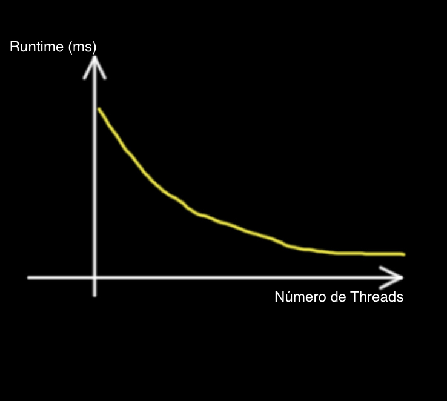

# Exercício 2
## Grupo: Carolina Vasconcelos, Cao Guim, Ewerton Luna e Mariana Coutinho.

### Letra a
A maneira que usamos para identificar qual das Threads está imprimindo no console foi concatenando à mensagem "Hello Thread!" o valor do ID que é passado no construtor da thread.
A garantia que o programa só irá encerrar após a segunda Thread terminar de executar é dada pelo método da
classe java.lang.Thread chamado join(), que espera a thread atual encerrar antes de prosseguir.

### Letra b
Sim. O tempo de execução medido de computePrimeFactors é mais curto dentro da Thread que não é a principal. Quando a gente seta o Timer fora da Thread secundária, isto é, na Thread principal, o tempo marcado é maior, pois a Thread principal espera a Thread secundária iniciar a execução, terminar de executar computePrimeFactors e sair da Thread.
Então, logicamente, o tempo marcado fora da Thread secundária é maior do que o de dentro dela.

### Letra c
Solução demonstrada através do código.

### Letra d
Solução demonstrada através do código.

### Letra e
Solução demonstrada através do código.

### Letra f
  
Imaginamos que o gráfico que representa o tempo de execução de uma tarefa versus o número de threads teria o formato da imagem acima.
Para conseguir ter um formato mais bem definido dessa maneira, é importante que o tamanho do input, nesse caso, o array de entrada, seja grande. Para valores pequenos, por exemplo, um array de 100 elementos, o ganho no tempo de execução não seria tão aparente.
No entando, a medida que o input escala, fica mais perceptível o ganho de desempenho com o aumento no número de Threads e, por consequência, o benefício da paralelização.
