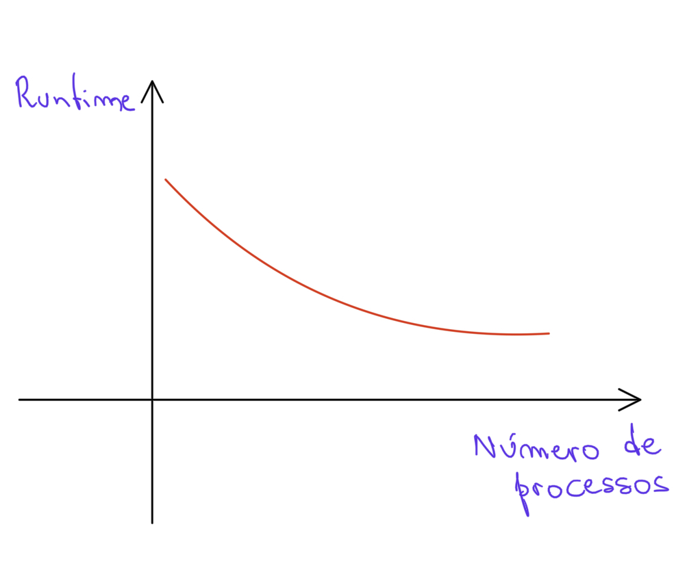

# Exercício 2
## Grupo: Carolina Vasconcelos, Ewerton Luna, Marcela Cavalcante, Mariana Coutinho
### Letra a
Sim. As mensagens foram impressas no console de maneira desordenada.
### Letra b
Pela mesma razão que existiu no caso da implementação de Java usando threads, o tempo de execução medido no processo principal foi maior, já que o processo principal é o responsável por criar o segundo processo, fazê-lo executar e esperar a execução do processo terminar.

### Letra c
Solução demonstrada através do código.

### Letra d
Solução demonstrada através do código.

### Letra e
Solução demonstrada através do código.
### Letra f
  
Imaginamos que o gráfico que representa o tempo de execução de uma tarefa versus o número de processos teria o formato da imagem acima.
Para conseguir ter um formato mais bem definido dessa maneira, é importante que o tamanho do input, nesse caso, o array de entrada, seja grande. Para valores pequenos, por exemplo, um array de 100 elementos, o ganho no tempo de execução não seria tão aparente.
No entando, a medida que o input escala, fica mais perceptível o ganho de desempenho com o aumento no número de processos e, por consequência, o benefício da paralelização.